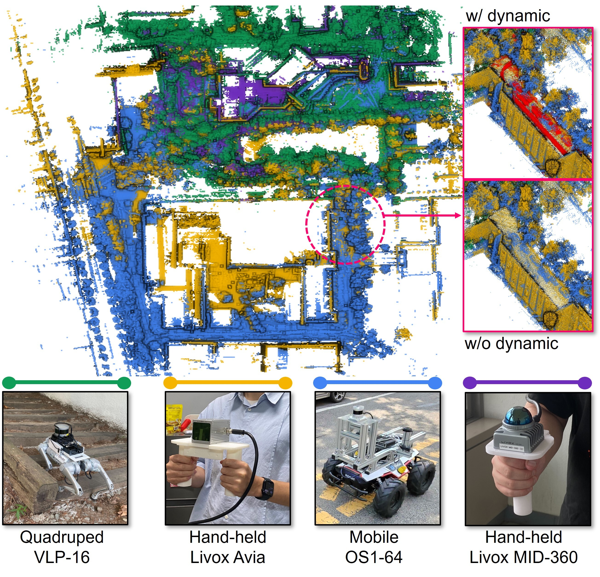

# Uni-mapper
[**Paper**]() | [**Website**](https://sites.google.com/view/uni-mapper/home) | [**Video**](https://www.youtube.com/watch?v=MjOGxNkyeOM)

This repository is the official code of the paper:

> **Uni-Mapper: Unified Mapping Framework for Multi-modal LiDARs in Complex and Dynamic Environments**
>
> [Gilhwan Kang](https://scholar.google.com/citations?user=F6dY8DoAAAAJ&hl=ko), [Hogyun Kim](https://scholar.google.com/citations?user=t5UEbooAAAAJ&hl=ko), [Byunghee Choi](), [Seokhwan Jeong](), [Young-Sik Shin](https://scholar.google.com/citations?user=gGfBRawAAAAJ&hl=ko)&ast;, and [Younggun Cho](https://scholar.google.com/citations?user=W5MOKWIAAAAJ&hl=ko&oi=ao)&ast;.  
> &ast; Corresponding Authors.   
>
> *under review for journal paper*  
> (Best Research Award 3rd prize for *ICRA* workshop on Future of Construction, 2024.)

**Abstract**  
This repository represent the code for **Uni-mapper**, our map-merging framework for multi-modal LiDARs and dynamic environments.

## Table of Contents
> **__Note__** The code will be released after review process.
>
> **Setup**
> - Installation
> - Datasets
>
> **Example**
> - Merging multiple maps